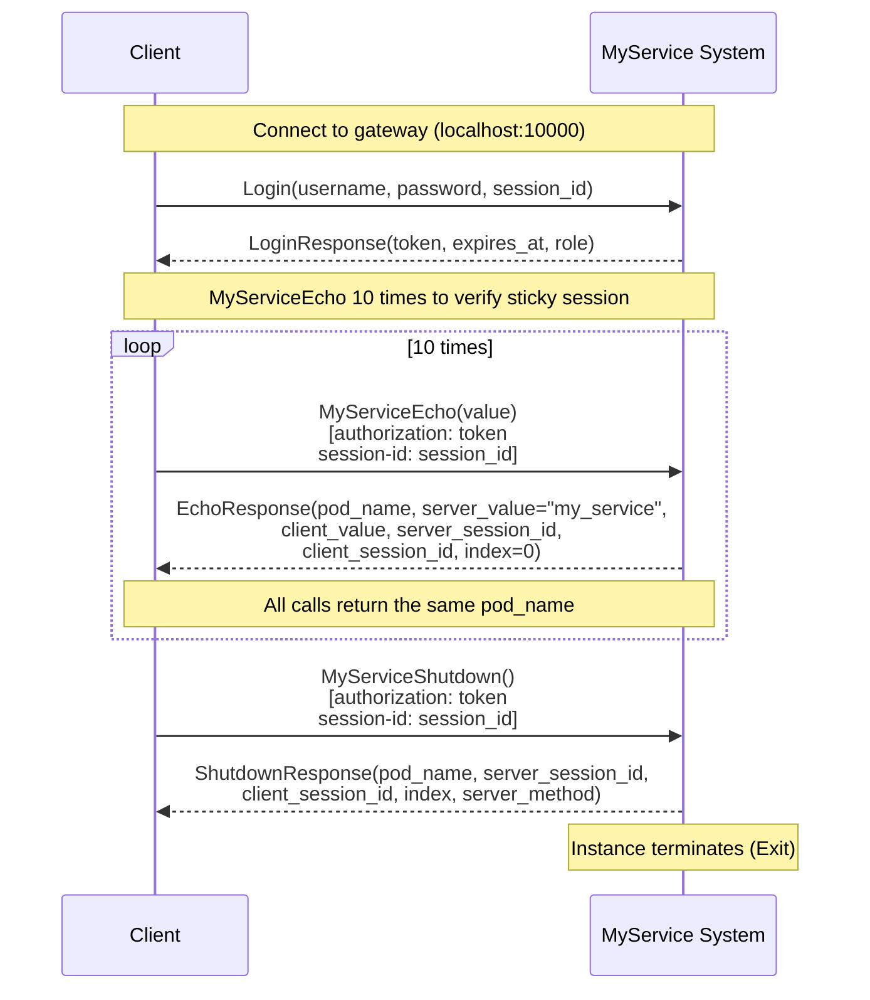

# Basic scenario: Login → MyServiceEcho → MyServiceShutdown

## Description

The basic scenario demonstrates the standard client workflow with the MyService system. The client connects, authenticates, performs several operations with sticky session verification, and then shuts down the session correctly.

**Implementation:** [`scenario/basic_workflow.go`](../scenario/basic_workflow.go)  
**Run:** `./integrationtests basic_workflow`

## Steps

### 1. Connect to the system

The client creates a gRPC connection to the API Gateway at `localhost:10000` (or the address set via `--gateway`).

### 2. Authentication (Login)

**Request:**
- Method: `Login`
- Parameters:
  - `username`: user name (e.g. "TestUser")
  - `password`: user password (e.g. "TestPassword")
  - `session_id`: unique client session identifier

**Success response:**
- `token`: JWT for subsequent requests (non-empty)
- `expires_at`: token expiry time (non-nil)
- `role`: user role

**Possible errors:**
- `INVALID_ARGUMENT` (3): "username is required" — when username is empty
- `INVALID_ARGUMENT` (3): "session_id is required" — when session_id is empty
- `PERMISSION_DENIED` (7): "invalid username or password" — when credentials are wrong
- `INTERNAL` (13): "failed to get user" or "failed to create token" — server internal error

### 3. MyServiceEcho (10 times)

After successful authentication the client calls `MyServiceEcho` 10 times in a row to verify sticky session.

**Request:**
- Method: `MyServiceEcho`
- Parameters:
  - `value`: string for echo (e.g. "integration-test-echo")
- Metadata headers:
  - `authorization`: "<token>" (JWT from Login)
  - `session-id`: "<session_id>" (same session_id used in Login)

**Success response (EchoResponse):**
- `client_value`: value from request (must match `value`)
- `server_value`: constant "my_service"
- `pod_name`: unique instance identifier (non-empty)
- `server_session_id`: server session identifier (non-empty)
- `client_session_id`: client session identifier from header (non-empty)
- `index`: message number (for MyServiceEcho always 0)
- `server_method`: method name (e.g. "MyServiceEcho")

**Sticky session check:**
- All 10 calls must return the same `pod_name`
- This confirms all requests are sent to the same instance

**Possible errors:**
- `UNAUTHENTICATED` (16): missing or invalid authorization token
- `INTERNAL` (13): "Session conflict: was={old_session}, now={new_session}" — session conflict on instance
- `UNAVAILABLE` (14): "backend service unavailable" — backend connection error
- `RESOURCE_EXHAUSTED` (8): "no available instances" or "all instances are busy" — no available instances

### 4. Session shutdown (MyServiceShutdown)

After all operations the client shuts down the session.

**Request:**
- Method: `MyServiceShutdown`
- Parameters: `ShutdownRequest` (empty message)
- Metadata headers:
  - `authorization`: "<token>"
  - `session-id`: "<session_id>"

**Success response (ShutdownResponse):**
- `pod_name`: instance identifier (must match the one from MyServiceEcho)
- `server_session_id`: server session identifier (non-empty)
- `client_session_id`: client session identifier (non-empty)
- `index`: message number
- `server_method`: method name (e.g. "MyServiceShutdown")

**Note:** After sending the response the instance terminates (Exit), which stops the container. This is expected.

**Possible errors:**
- `PERMISSION_DENIED` (7): "Server session is not set" — when server session is empty
- `PERMISSION_DENIED` (7): "Client session mismatch: client={client_session}, server={server_session}" — when client session does not match server session
- `UNAUTHENTICATED` (16): missing or invalid authorization token

## Interaction diagram

## Error code table

| Situation | gRPC Code | Numeric | Message |
|-----------|-----------|---------|---------|
| Empty username in Login | `INVALID_ARGUMENT` | 3 | "username is required" |
| Empty session_id in Login | `INVALID_ARGUMENT` | 3 | "session_id is required" |
| Invalid credentials | `PERMISSION_DENIED` | 7 | "invalid username or password" |
| Server session not set | `PERMISSION_DENIED` | 7 | "Server session is not set" |
| Client session mismatch | `PERMISSION_DENIED` | 7 | "Client session mismatch: client={...}, server={...}" |
| Session conflict | `INTERNAL` | 13 | "Session conflict: was={...}, now={...}" |
| No available instances | `RESOURCE_EXHAUSTED` | 8 | "no available instances" |
| All instances busy | `RESOURCE_EXHAUSTED` | 8 | "all instances are busy" |
| Connection error | `UNAVAILABLE` | 14 | "backend service unavailable" |
| Missing token | `UNAUTHENTICATED` | 16 | - |
| Invalid token | `UNAUTHENTICATED` | 16 | - |

## Validations

The scenario checks:

1. **Login:**
   - Token is non-empty
   - `expires_at` is not nil
   - `role` is non-empty

2. **MyServiceEcho:**
   - `client_value` matches the sent value
   - `server_value == "my_service"`
   - `pod_name` is non-empty
   - `server_session_id` and `client_session_id` are non-empty
   - `index == 0` (unary call)
   - `server_method` is non-empty
   - All 10 calls return the same `pod_name` (sticky session)

3. **MyServiceShutdown:**
   - `pod_name` matches the one from MyServiceEcho
   - `server_session_id` and `client_session_id` are non-empty
   - `server_method` is non-empty
