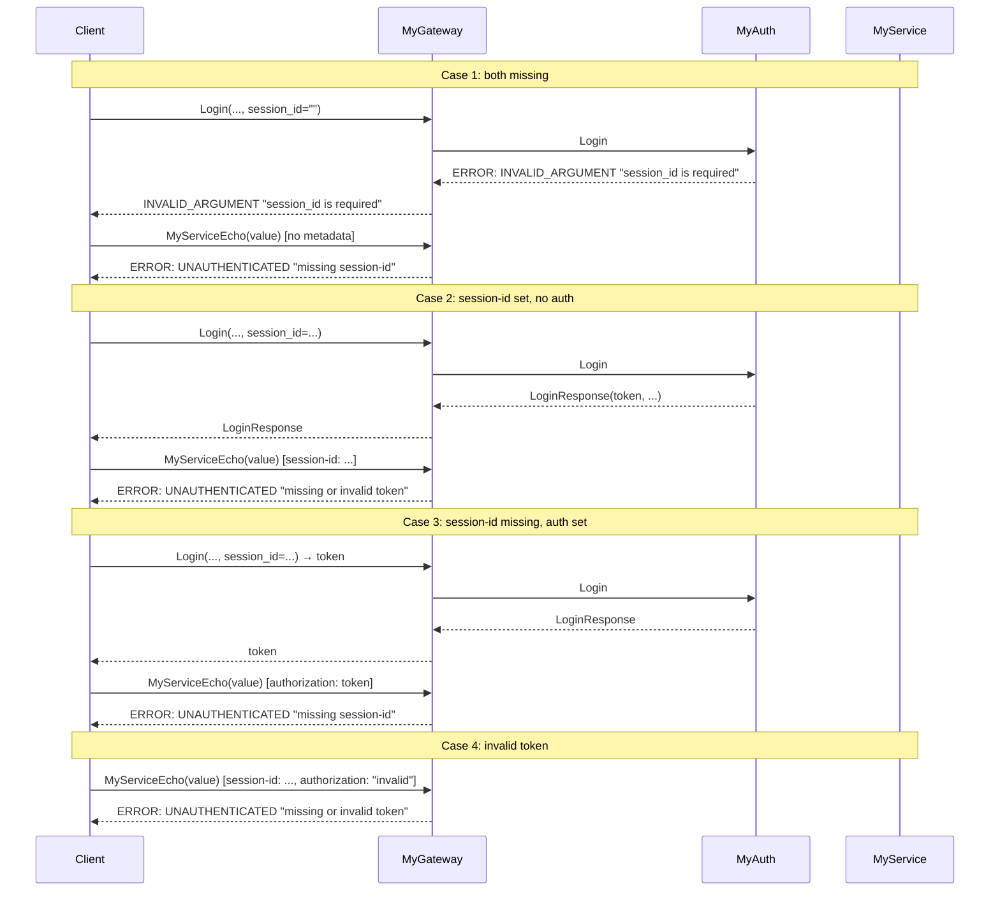

# Scenario: Authentication and session-id errors (Login and MyServiceEcho)

## Description

This scenario checks that MyGateway and MyAuth handle missing `session-id` and missing/invalid JWT separately. For MyService* methods, when `session-id` is missing in metadata the gateway returns `UNAUTHENTICATED` with "missing session-id"; when session-id is present but token is missing or invalid — "missing or invalid token". For Login, `session_id` in the request body is required (FR-AUTH-2); when missing MyAuth returns `INVALID_ARGUMENT` "session_id is required". The scenario covers four combinations: (1) both missing, (2) session-id set, authorization missing, (3) session-id missing, authorization set, (4) session-id set, invalid token.

**Implementation:** [`scenario/gateway_error_unauthenticated.go`](../scenario/gateway_error_unauthenticated.go)  
**Run:** `./integrationtests gateway_error_unauthenticated`

**Related requirements:**
- FR-MGW-5: Handling no instances and JWT (MyGateway error codes: "missing session-id", "missing or invalid token")
- FR-AUTH-2: Login request validation (session_id required in body)

## Steps

### 1. Connect to the system

The client creates a gRPC connection to the API Gateway at `localhost:10000` (or `--gateway`).

### 2. Case 1: session-id and authorization both missing

**Login:** Call with empty `session_id` in request body (username and password set).

- Expect: error `INVALID_ARGUMENT` (3), message "session_id is required" (MyAuth, FR-AUTH-2).

**MyServiceEcho:** Call with no metadata (no `session-id`, no `authorization`).

- Expect: error `UNAUTHENTICATED` (16), message "missing session-id". MyGateway checks session-id before token; when it is missing this message is returned.

### 3. Case 2: session-id set, authorization missing

**Login:** Call with `session_id` set in body (username, password, session_id). Authorization header is not required for Login.

- Expect: success (token, expires_at, role).

**MyServiceEcho:** Call with metadata only `session-id` (no `authorization`).

- Expect: error `UNAUTHENTICATED` (16), message "missing or invalid token".

### 4. Case 3: session-id missing, authorization set

**Login:** Call with empty `session_id` in body (check that MyAuth requires the field).

- Expect: error `INVALID_ARGUMENT` (3), message "session_id is required".

**MyServiceEcho:** First perform a successful Login with a set session_id to get a valid token. Then call MyServiceEcho with metadata only `authorization: <token>` (no `session-id` header).

- Expect: error `UNAUTHENTICATED` (16), message "missing session-id". The gateway requires session-id in metadata for MyService* routes regardless of token.

### 5. Case 4: session-id set, invalid token

**MyServiceEcho:** Call with metadata `authorization: "invalid_token_format"` and `session-id: "integration-test-session-{timestamp}"`.

- Expect: error `UNAUTHENTICATED` (16), message "missing or invalid token".

## Interaction diagram

## Error code table

| Situation | gRPC Code | Numeric | Message |
|-----------|-----------|---------|---------|
| Login: empty session_id in body | `INVALID_ARGUMENT` | 3 | "session_id is required" |
| MyService*: missing session-id header | `UNAUTHENTICATED` | 16 | "missing session-id" |
| MyService*: missing or invalid JWT (with session-id) | `UNAUTHENTICATED` | 16 | "missing or invalid token" |

## Validations

The scenario checks:

1. **Case 1 (both missing):**
   - Login with empty session_id in body → `INVALID_ARGUMENT`, message "session_id is required".
   - MyServiceEcho with no metadata → `UNAUTHENTICATED`, message "missing session-id".

2. **Case 2 (session-id set, no authorization):**
   - Login with session_id set → success.
   - MyServiceEcho with only session-id in metadata → `UNAUTHENTICATED`, message "missing or invalid token".

3. **Case 3 (session-id missing, authorization set):**
   - Login with empty session_id in body → `INVALID_ARGUMENT`, message "session_id is required".
   - MyServiceEcho with authorization and no session-id → `UNAUTHENTICATED`, message "missing session-id" (token obtained by separate successful Login).

4. **Case 4 (invalid token):**
   - MyServiceEcho with session-id and invalid authorization → `UNAUTHENTICATED`, message "missing or invalid token".

In all checks messages are compared to constants `expectedMsgMissingSessionID` and `expectedMsgMissingOrInvalidToken` in the scenario code.
