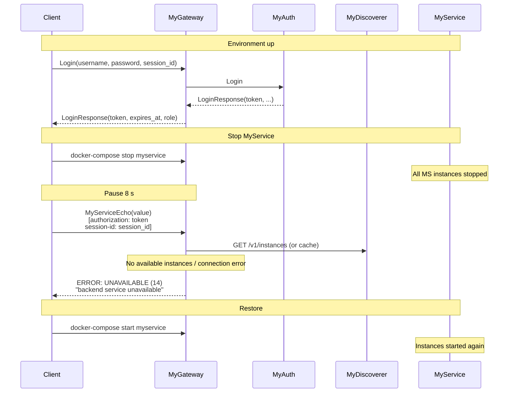

# Scenario: Gateway error — UNAVAILABLE (backend unavailable)

## Description

This scenario checks MyGateway behavior when the MyService backend is unavailable. The client first authenticates via Login (route to MyAuth). Then all MyService instances are stopped (`docker-compose stop myservice`). After a pause the client calls MyServiceEcho; the gateway must return code `UNAVAILABLE` (14) with message `"backend service unavailable"`. At the end of the scenario MyService is started again (`docker-compose start myservice`).

**Implementation:** [`scenario/gateway_error_unavailable.go`](../scenario/gateway_error_unavailable.go)  
**Run:** `./integrationtests --compose-file=../docker-compose.yml gateway_error_unavailable`

## Prerequisites

- Path to `docker-compose.yml` is required: `--compose-file` or `COMPOSE_FILE`. Without it the scenario fails.
- Environment is expected to be up before the scenario runs (`make up` or similar) so Login and initial gateway connection work.

## Steps

### 1. Connect and authenticate

The client creates a gRPC connection to the API Gateway and performs Login with valid credentials (e.g. test user TestUser:TestPassword).

**Login request:**
- Method: `Login`
- Parameters:
  - `username`: user name (e.g. "TestUser")
  - `password`: password (e.g. "TestPassword")
  - `session_id`: unique session identifier (e.g. "integration-test-session-unavailable-{timestamp}")

**Success response:**
- `token`: JWT
- `expires_at`: expiry time
- `role`: user role

Login is routed to MyAuth and does not depend on MyService availability.

### 2. Stop MyService

The scenario calls `docker.StopService(workDir, "myservice")`, which runs `docker-compose stop myservice` in the directory containing `docker-compose.yml`. All MyService instances become unavailable; on the next request to a MyService* route MyGateway will not be able to connect to the backend.

### 3. Wait for gateway state update

Pause for 8 seconds (`time.Sleep(8 * time.Second)`) so the gateway can detect that no instances are available or get connection errors when trying to proxy.

### 4. Call MyServiceEcho (expected error)

The client calls MyServiceEcho with the valid token and session-id from step 1.

**Request:**
- Method: `MyServiceEcho`
- Parameters:
  - `value`: string for echo (e.g. "integration-test-echo")
- Metadata:
  - `authorization`: "<token>" from Login
  - `session-id`: "<session_id>" from Login

**Expected error:**
- Code: `UNAVAILABLE` (14)
- Message: "backend service unavailable"

**Note:** The error is produced by MyGateway when it cannot connect to the MyService cluster (all instances stopped).

### 5. Restore environment

In `defer` the scenario calls `docker.StartService(workDir, "myservice")` (`docker-compose start myservice`) to bring instances back for later scenarios or manual checks. If start fails a warning is printed, but the scenario is still successful if the code and message check in step 4 passed.

## Interaction diagram

## Error code table

| Situation | gRPC Code | Numeric | Message |
|-----------|-----------|---------|---------|
| Backend unavailable (MyService*) | `UNAVAILABLE` | 14 | "backend service unavailable" |

## Validations

The scenario checks:

1. **ComposePath:**
   - If `cfg.ComposePath` is empty, the scenario returns an error before any actions.

2. **Login:**
   - Login succeeds (token and response pass standard Login helper validation).

3. **MyServiceEcho after stopping MyService:**
   - The call returns an error (not success).
   - `status.Code() == UNAVAILABLE`.
   - `status.Message() == "backend service unavailable"`.

4. **Restore:**
   - In `defer`, `docker.StartService` is run; on error a warning is printed but the test does not fail.
