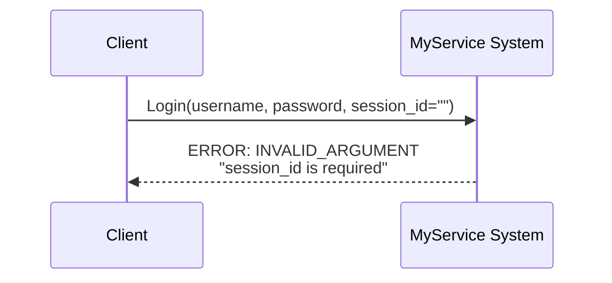
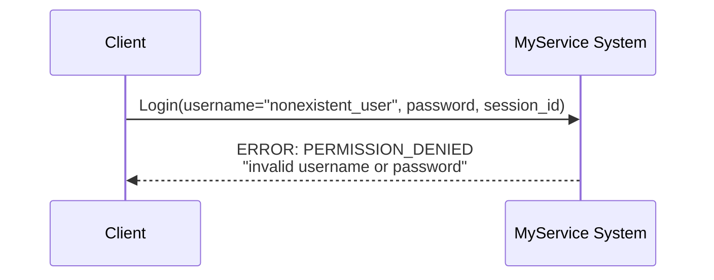
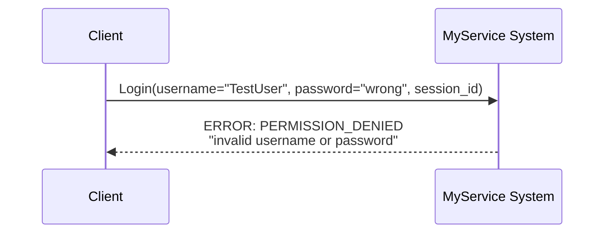
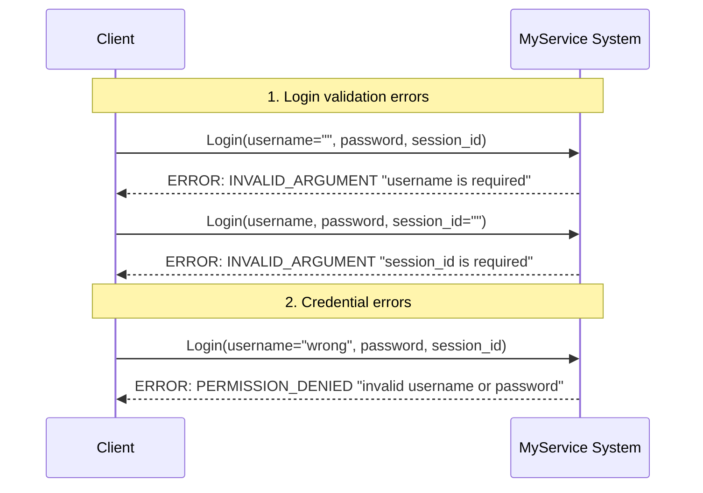

# Scenario: Login errors

## Description

This scenario covers various Login error cases in the MyService system. It includes validation of input data and user credential checks.

**Status:** Described scenario (may not be fully implemented in test code)  
**Related requirements:**
- FR-AUTH-2: Login request validation
- FR-AUTH-3: Credential verification

## Sub-scenarios

### 1. Login validation errors

#### 1.1. Empty username

**Request:**
- Method: `Login`
- Parameters:
  - `username`: "" (empty string)
  - `password`: "password"
  - `session_id`: "session-123"

**Expected error:**
- Code: `INVALID_ARGUMENT` (3)
- Message: "username is required"

**Diagram:**

#### 1.2. Empty session_id

**Request:**
- Method: `Login`
- Parameters:
  - `username`: "user"
  - `password`: "password"
  - `session_id`: "" (empty string)

**Expected error:**
- Code: `INVALID_ARGUMENT` (3)
- Message: "session_id is required"

**Diagram:**

#### 1.3. Nil request

**Request:**
- Method: `Login`
- Parameters: `nil`

**Expected error:**
- Code: `INVALID_ARGUMENT` (3)
- Message: "request is nil"

### 2. Credential verification errors

#### 2.1. Invalid username

**Request:**
- Method: `Login`
- Parameters:
  - `username`: "nonexistent_user"
  - `password`: "password"
  - `session_id`: "session-123"

**Expected error:**
- Code: `PERMISSION_DENIED` (7)
- Message: "invalid username or password"

**Diagram:**

#### 2.2. Wrong password

**Request:**
- Method: `Login`
- Parameters:
  - `username`: "TestUser" (existing user)
  - `password`: "wrong_password"
  - `session_id`: "session-123"

**Expected error:**
- Code: `PERMISSION_DENIED` (7)
- Message: "invalid username or password"

**Diagram:**

## Login errors overview diagram

## Error code table

| Situation | gRPC Code | Numeric | Message | Category |
|-----------|-----------|---------|---------|----------|
| Empty username | `INVALID_ARGUMENT` | 3 | "username is required" | Validation |
| Empty session_id | `INVALID_ARGUMENT` | 3 | "session_id is required" | Validation |
| Nil request | `INVALID_ARGUMENT` | 3 | "request is nil" | Validation |
| User not found | `PERMISSION_DENIED` | 7 | "invalid username or password" | Credentials |
| Wrong password | `PERMISSION_DENIED` | 7 | "invalid username or password" | Credentials |

## Error grouping

### Input validation (INVALID_ARGUMENT)
- Empty username
- Empty session_id
- Nil request

### Credential verification (PERMISSION_DENIED)
- Invalid username
- Wrong password
- User not found

## Error handling recommendations

### For client applications

1. **Validation before send:**
   - Ensure username and session_id are non-empty before calling Login
   - Validate data format on the client before sending the request

2. **Validation error handling:**
   - On `INVALID_ARGUMENT` — check input and fix before retry
   - Show the user a clear message about which fields are required

3. **Credential error handling:**
   - On `PERMISSION_DENIED` in Login — show invalid credentials message
   - Do not reveal whether username or password is wrong (security)
   - Allow the user to re-enter credentials

4. **Retry logic:**
   - Do not retry on `PERMISSION_DENIED` without correcting credentials
   - Do not retry on `INVALID_ARGUMENT` without correcting input

## Notes

- **Security:** Error messages should not reveal whether a user with the given username exists
- **Consistency:** Error messages should be clear and consistent
- **Implementation:** This scenario is described in requirements (FR-AUTH-2, FR-AUTH-3) but may not be fully implemented in current integration tests
