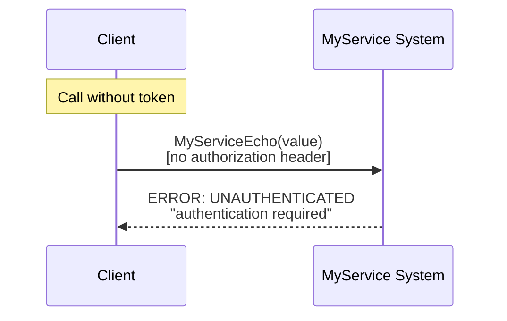
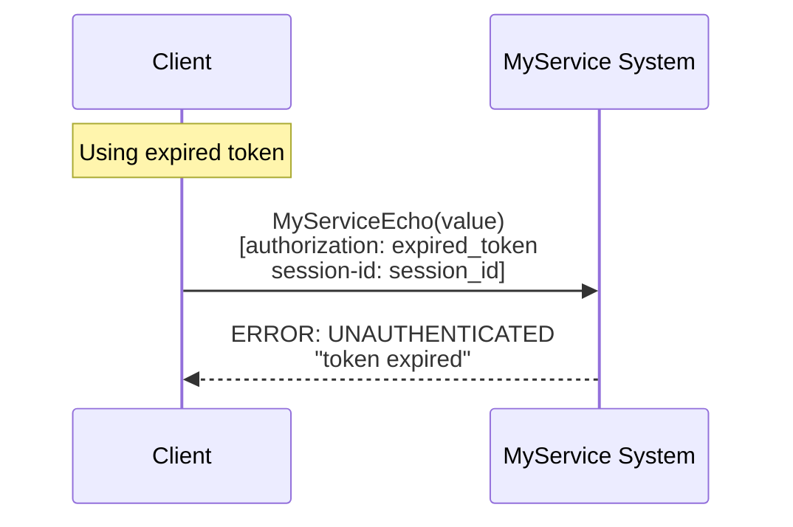
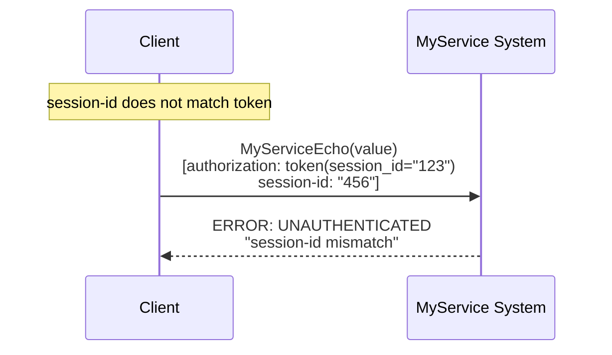
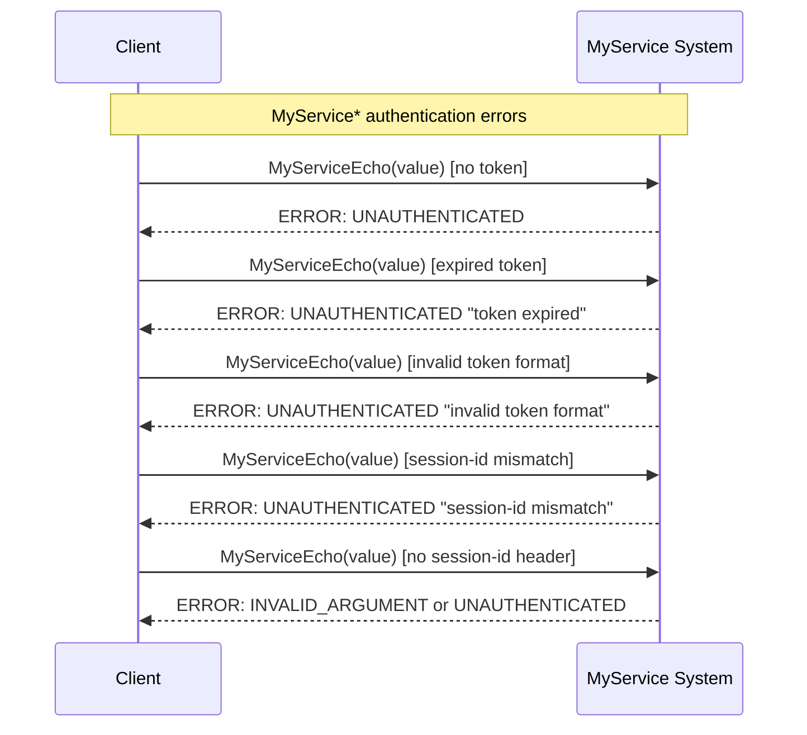

# Scenario: Authentication errors for MyService* methods

## Description

This scenario covers authentication error cases when calling `MyServiceEcho` and `MyServiceSubscribe` in the MyService system. It includes presence of token, token validity, and session-id match.

**Status:** Described scenario (may not be implemented in test code)  
**Related requirements:**
- FR-MS-5: Authentication of MyService* requests

**Note:** This scenario applies to `MyServiceEcho` and `MyServiceSubscribe`. `MyServiceShutdown` is used only for testing and is not covered here.

## Authentication errors

### 1. Missing authorization token

**Request:**
- Method: `MyServiceEcho` or `MyServiceSubscribe`
- Parameters:
  - `value`: "test-value"
- Metadata: no `authorization` header

**Expected error:**
- Code: `UNAUTHENTICATED` (16)
- Message: (implementation-dependent)

**Diagram:**


### 2. Invalid token format

**Request:**
- Method: `MyServiceEcho` or `MyServiceSubscribe`
- Parameters:
  - `value`: "test-value"
- Metadata:
  - `authorization`: "invalid_token_format"
  - `session-id`: "session-123"

**Expected error:**
- Code: `UNAUTHENTICATED` (16)
- Message: (e.g. "invalid token format")

### 3. Expired token

**Request:**
- Method: `MyServiceEcho` or `MyServiceSubscribe`
- Parameters:
  - `value`: "test-value"
- Metadata:
  - `authorization`: "<expired_token>" (token past expiry)
  - `session-id`: "session-123"

**Expected error:**
- Code: `UNAUTHENTICATED` (16)
- Message: (e.g. "token expired")

**Diagram:**


### 4. session-id mismatch with token

**Request:**
- Method: `MyServiceEcho` or `MyServiceSubscribe`
- Parameters:
  - `value`: "test-value"
- Metadata:
  - `authorization`: "<valid_token>" (token with session_id="session-123")
  - `session-id`: "session-456" (does not match token session_id)

**Expected error:**
- Code: `UNAUTHENTICATED` (16)
- Message: (e.g. "session-id mismatch")

**Diagram:**


### 5. Missing session-id header

**Request:**
- Method: `MyServiceEcho` or `MyServiceSubscribe`
- Parameters:
  - `value`: "test-value"
- Metadata:
  - `authorization`: "<valid_token>"
  - `session-id`: missing

**Expected error:**
- Code: `INVALID_ARGUMENT` (3) or `UNAUTHENTICATED` (16)
- Message: "session-id header is required" or similar

## Authentication errors overview diagram



## Error code table

| Situation | gRPC Code | Numeric | Message | Category |
|-----------|-----------|---------|---------|----------|
| Missing token | `UNAUTHENTICATED` | 16 | - | Authentication |
| Invalid token format | `UNAUTHENTICATED` | 16 | - | Authentication |
| Expired token | `UNAUTHENTICATED` | 16 | "token expired" | Authentication |
| session-id mismatch | `UNAUTHENTICATED` | 16 | "session-id mismatch" | Authentication |
| Missing session-id header | `INVALID_ARGUMENT` or `UNAUTHENTICATED` | 3 or 16 | "session-id header is required" | Validation/Auth |

## Error grouping

### Authentication (UNAUTHENTICATED)
- Missing token
- Invalid token format
- Expired token
- session-id mismatch with token

### Validation (INVALID_ARGUMENT)
- Missing required headers (session-id)

## Error handling recommendations

### For client applications

1. **Pre-send checks:**
   - Ensure token is obtained via Login before calling MyService* methods
   - Check that token and session-id headers are present before sending

2. **Authentication errors:**
   - On `UNAUTHENTICATED` — get a new token via Login
   - On "token expired" — perform Login again for a new token
   - On "session-id mismatch" — use the session-id that matches the token

3. **Validation errors:**
   - If session-id header is missing — add it to request metadata
   - On `INVALID_ARGUMENT` — check header format and fix

4. **Retry logic:**
   - Do not retry on `UNAUTHENTICATED` without getting a new token
   - After a new token from Login — retry the request with the new token
   - Do not retry on `INVALID_ARGUMENT` without fixing headers

## Usage examples

### Correct MyServiceEcho request

```go
// Pseudocode for correct usage

// 1. Get token via Login
token := login(username, password, sessionID)

// 2. Create context with auth
ctx := createAuthContext(token, sessionID)

// 3. Call MyServiceEcho with correct headers
response, err := client.MyServiceEcho(ctx, &EchoRequest{Value: "test-value"})
if err != nil {
    if isUnauthenticated(err) {
        token = login(username, password, sessionID)
        ctx = createAuthContext(token, sessionID)
        response, err = client.MyServiceEcho(ctx, &EchoRequest{Value: "test-value"})
    }
}
```

### Handling expired token

```go
// Pseudocode for expired token handling

response, err := client.MyServiceEcho(ctx, &EchoRequest{Value: "test-value"})
if err != nil {
    st, ok := status.FromError(err)
    if ok && st.Code() == codes.Unauthenticated {
        newToken := login(username, password, sessionID)
        ctx = createAuthContext(newToken, sessionID)
        response, err = client.MyServiceEcho(ctx, &EchoRequest{Value: "test-value"})
    }
}
```

## Notes

- **Security:** Authentication errors must not expose internal system details
- **Consistency:** Error messages should be clear and consistent
- **Scope:** This scenario applies to `MyServiceEcho` and `MyServiceSubscribe`. `MyServiceShutdown` is used only for testing
- **Implementation:** Described in requirements (FR-MS-5) but may not be fully implemented in current integration tests
