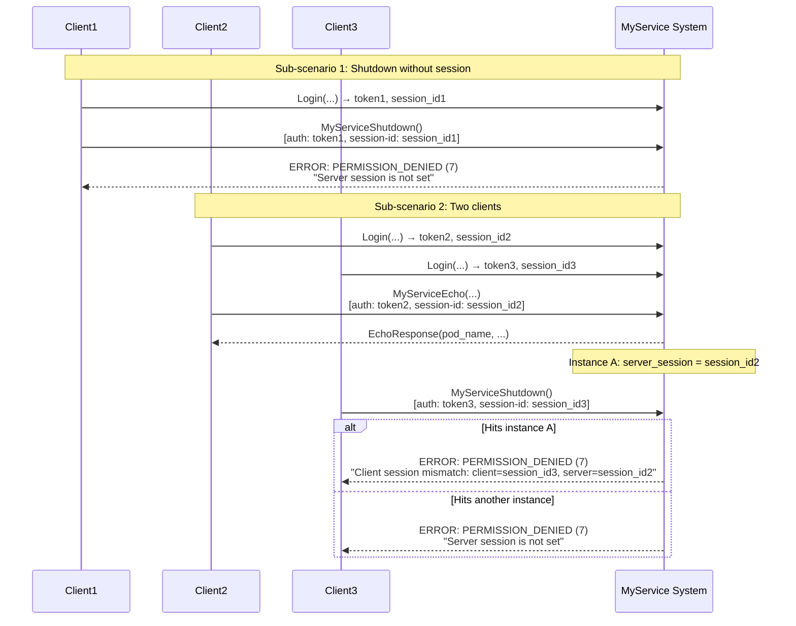

# Scenario: MyServiceShutdown errors (FR-MS-7)

## Description

This scenario checks two MyServiceShutdown error cases per FR-MS-7: (1) Call MyServiceShutdown without a session set on the instance (server session empty) — expect `PERMISSION_DENIED` with message "Server session is not set"; (2) Call MyServiceShutdown from a second client that may land on the same instance as the first (then server session does not match client session) — expect `PERMISSION_DENIED` with message "Client session mismatch: ..." or "Server session is not set" if the request hits another instance. Both outcomes in the second sub-scenario are acceptable.

**Implementation:** [`scenario/myservice_shutdown_errors.go`](../scenario/myservice_shutdown_errors.go)  
**Run:** `./integrationtests myservice_shutdown_errors`

**Related requirements:**
- FR-MS-7: MyServiceShutdown (checks before performing shutdown)
- FR-4: Sticky session (routing by session-id)

## Steps

### 1. Connect first client

The client creates a gRPC connection to the API Gateway at `localhost:10000`.

### 2. Authenticate and MyServiceShutdown without established session

The client performs Login with a unique session_id (e.g. "integration-test-session-shutdown1-{timestamp}"), then immediately calls MyServiceShutdown without calling MyServiceEcho or MyServiceSubscribe. The request is routed to one of the MyService instances; on that instance the server session is not set yet.

**Login request:**
- Method: `Login`
- Parameters: `username`, `password`, `session_id` (unique for this client)

**MyServiceShutdown request:**
- Method: `MyServiceShutdown`
- Parameters: `ShutdownRequest` (empty message)
- Metadata:
  - `authorization`: "<token>" from Login
  - `session-id`: "<session_id>" from Login

**Expected error:**
- Code: `PERMISSION_DENIED` (7)
- Message: "Server session is not set"

**Note:** Per FR-MS-7, before performing shutdown it is checked that server session is not empty; otherwise this error is returned.

### 3. Second sub-scenario: two clients, second calls MyServiceShutdown

A second client is created (second gRPC connection). Both clients perform Login with different session_ids (e.g. "integration-test-session-shutdown2-{timestamp}" and "integration-test-session-shutdown3-{timestamp}").

**Client 2 (same connection reused for Login with session_id2):**
- Login with session_id2, get token2.
- Call MyServiceEcho with token2 and session_id2 — session is set on one instance (say instance A). Instance A now has server_session = session_id2.

**Client 3 (second connection):**
- Login with session_id3, get token3.
- Call MyServiceShutdown with token3 and session_id3 (no prior Echo). The request is routed by session_id3. Depending on balancing it may hit the same instance A (then on A server_session = session_id2, client sent session_id3 — mismatch) or another instance B (then on B server session is empty).

**Expected error (one of two):**
- Code: `PERMISSION_DENIED` (7)
- Message: "Server session is not set" — if the request hit an instance with no session set.
- Message: "Client session mismatch: client={session_id3}, server={session_id2}" (or similar) — if the request hit instance A where session_id2 is already set.

The scenario accepts either of these two responses; if "Client session mismatch" is received, it also checks that the message contains the third client's session_id (session_id3).

## Interaction diagram

## Error code table

| Situation | gRPC Code | Numeric | Message |
|-----------|-----------|---------|---------|
| Server session not set | `PERMISSION_DENIED` | 7 | "Server session is not set" |
| Client session does not match server | `PERMISSION_DENIED` | 7 | "Client session mismatch: client={...}, server={...}" |

## Validations

The scenario checks:

1. **Sub-scenario 1:**
   - MyServiceShutdown without prior Echo/Subscribe returns an error (not success).
   - `status.Code() == PERMISSION_DENIED`.
   - `status.Message() == "Server session is not set"` (exact match).

2. **Sub-scenario 2:**
   - MyServiceShutdown from the second client returns an error (not success).
   - `status.Code() == PERMISSION_DENIED`.
   - Message is either exactly "Server session is not set" or starts with "Client session mismatch:".
   - If the message starts with "Client session mismatch:", it must contain the third client's session_id (session_id3).

3. **Setup correctness:**
   - Login and MyServiceEcho for client 2 succeed (validated via shared helpers).
