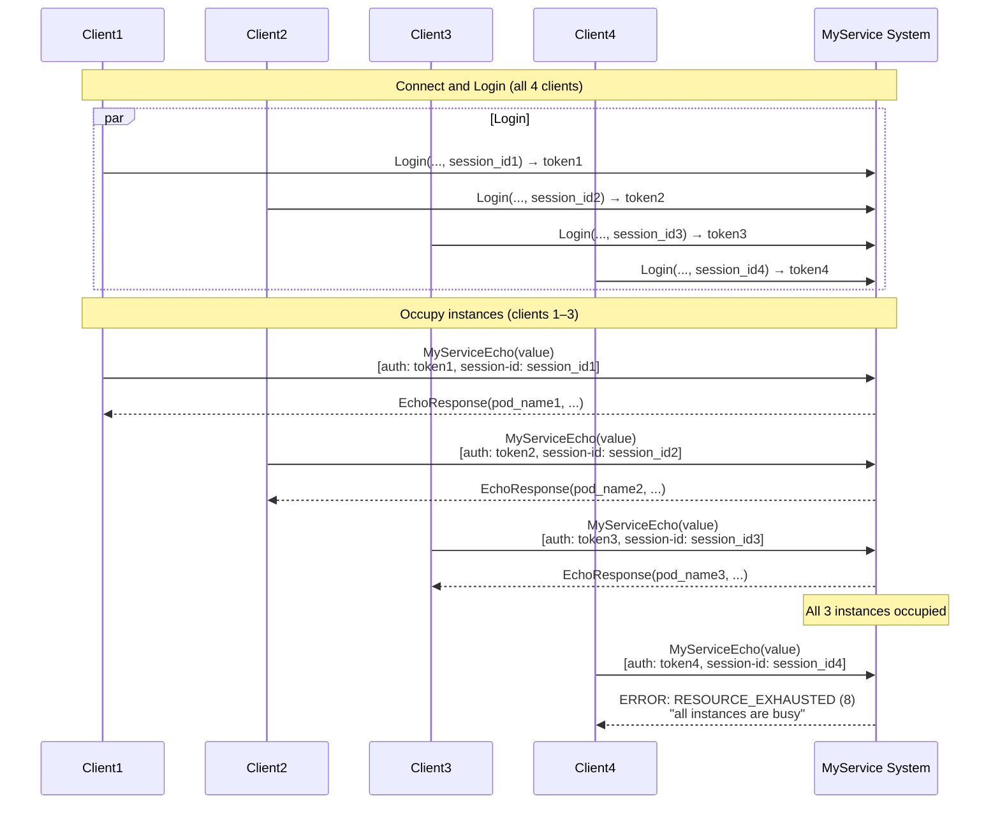

# Scenario: All instances busy (RESOURCE_EXHAUSTED)

## Description

This scenario checks system behavior when all MyService instances are already occupied by active sessions. Four clients connect to the gateway and authenticate. The first three call MyServiceEcho (without MyServiceShutdown), occupying all three instances in a typical three-replica MyService deployment. The fourth client calls MyServiceEcho and must receive from MyGateway code `RESOURCE_EXHAUSTED` (8) with message `"all instances are busy"`.

**Implementation:** [`scenario/no_instances_available.go`](../scenario/no_instances_available.go)  
**Run:** `./integrationtests no_instances_available`

## Steps

### 1. Connect four clients

Four clients create independent gRPC connections to the API Gateway at `localhost:10000` (or `--gateway`). Each client gets a unique session_id like "integration-test-session-noinst-{N}-{timestamp}" (N = 1..4).

### 2. Authenticate all four clients

Each client performs Login with the same credentials (e.g. test user) but different session_ids.

**For each client 1..4:**
- Method: `Login`
- Parameters:
  - `username`: user name
  - `password`: password
  - `session_id`: unique per client (e.g. "integration-test-session-noinst-1-{timestamp}", ..., "integration-test-session-noinst-4-{timestamp}")

**Success response for each:**
- `token`: JWT (different tokens for different session_id)
- `expires_at`: expiry time
- `role`: user role

### 3. Occupy three instances (clients 1, 2, 3)

Clients 1, 2, and 3 call MyServiceEcho in turn with their token and session_id. MyServiceShutdown is not called, so each remains bound to its instance (sticky session). With three MyService replicas, all three instances are occupied.

**For clients 1, 2, 3:**
- Method: `MyServiceEcho`
- Parameters:
  - `value`: string for echo (e.g. "integration-test-echo")
- Metadata:
  - `authorization`: "<token>" for that client
  - `session-id`: "<session_id>" for that client

**Success response (EchoResponse):**
- `client_value`, `server_value` ("my_service"), `pod_name`, `server_session_id`, `client_session_id`, `index` (0), `server_method` — checked by shared Echo helper.

After this, all three instances are occupied by clients 1, 2, and 3.

### 4. Fourth client calls MyServiceEcho (expected error)

Client 4 calls MyServiceEcho with a valid token and its session_id. No instances are free; MyGateway must return the error described below.

**Request:**
- Method: `MyServiceEcho`
- Parameters:
  - `value`: string for echo
- Metadata:
  - `authorization`: "<token4>"
  - `session-id`: "<session_id4>"

**Expected error:**
- Code: `RESOURCE_EXHAUSTED` (8)
- Message: "all instances are busy"

**Note:** The message must match the constant in MyGateway (see gateway error mapping). The scenario does not call MyServiceShutdown for clients 1–3, so after the test the three instances stay occupied until session expiry or restart.

## Interaction diagram

## "All instances busy" mechanism

### How it works

1. **One instance — one session:** Each MyService instance serves only one active session. After a client's first MyServiceEcho the instance is considered occupied for that session_id.
2. **Sticky session:** MyGateway routes requests with the same session-id to the same instance. Clients 1–3 are bound to three different instances.
3. **No free instances:** When client 4 sends MyServiceEcho, the gateway finds no free instance (all occupied by 1–3) and returns RESOURCE_EXHAUSTED with "all instances are busy".
4. **vs system_overload:** no_instances_available deterministically occupies exactly three instances with three clients and checks the exact message for the fourth; system_overload only checks that with 4 clients and 3 instances at least one client gets an error.

### Important points

- **Replica count:** Default docker-compose has 3 MyService replicas; the scenario is designed for that.
- **Cleanup:** Clients 1–3 do not call MyServiceShutdown; their sessions stay active until TTL or container restart.

## Error code table

| Situation | gRPC Code | Numeric | Message |
|-----------|-----------|---------|---------|
| All instances busy | `RESOURCE_EXHAUSTED` | 8 | "all instances are busy" |

## Validations

The scenario checks:

1. **Connect and Login:**
   - All four clients connect and perform Login successfully (token, expires_at, role validated by Login helper).

2. **Occupying instances:**
   - Clients 1, 2, and 3 call MyServiceEcho successfully (EchoResponse fields validated by Echo helper). No errors expected.

3. **Error for fourth client:**
   - Client 4's MyServiceEcho returns an error (not success).
   - `status.Code() == RESOURCE_EXHAUSTED`.
   - `status.Message() == "all instances are busy"` (exact match).

4. **Data structure:**
   - The scenario uses constants `numOccupants = 3` and `extraClient = 1`; the fourth client is the element at index `numOccupants` (3) in the clients slice.
