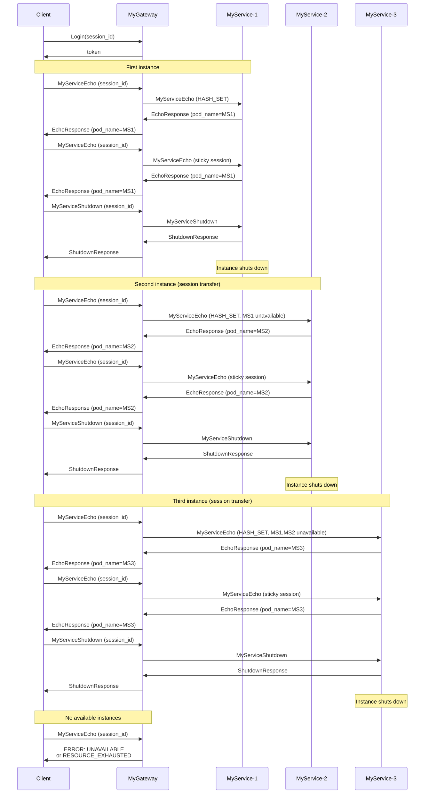

# Scenario: Session transfer when instance shuts down

## Description

This scenario demonstrates session transfer to another MyService instance when the current instance shuts down. The client keeps the same session but requests are automatically routed to available instances.

**Status:** Implemented  
**Implementation:** [`scenario/session_transfer.go`](../scenario/session_transfer.go)  
**Run:** `./integrationtests session_transfer` or `make itest_session_transfer`

**Related requirements:**
- FR-4: Sticky session and client binding to instances
- FR-5: Failure handling and recovery
- FR-MG-3: Load balancing (HASH_SET by session-id)
- FR-MS-7: MyServiceShutdown method

## Steps

### 1. Client authentication

**Request:**
- Method: `Login`
- Parameters:
  - `username`: user name
  - `password`: password
  - `session_id`: unique session_id (e.g. "integration-test-session-transfer-{timestamp}")

**Success response:**
- `token`: JWT
- `expires_at`: token expiry
- `role`: user role

### 2. First instance (service_id_1)

**Request 1:**
- Method: `MyServiceEcho`
- Metadata:
  - `authorization`: "<token>"
  - `session-id`: "<session_id>"

**Response:**
- `pod_name`: first instance identifier (e.g. "myservice-1")
- All other EchoResponse fields

**Request 2:**
- Method: `MyServiceEcho` (repeat to confirm sticky session)
- Metadata: same headers

**Response:**
- `pod_name`: same identifier "myservice-1" (sticky session confirmed)

**Request 3:**
- Method: `MyServiceShutdown`
- Metadata: same headers

**Response:**
- `pod_name`: "myservice-1"
- Instance exits after sending the response

### 3. Second instance (service_id_2)

After the first instance shuts down, the next request is routed to another available instance.

**Request 1:**
- Method: `MyServiceEcho`
- Metadata: same headers (same session)

**Response:**
- `pod_name`: second instance identifier (e.g. "myservice-2")
- Session successfully transferred to the new instance

**Request 2:**
- Method: `MyServiceEcho` (repeat to confirm sticky session)
- Metadata: same headers

**Response:**
- `pod_name`: same "myservice-2"

**Request 3:**
- Method: `MyServiceShutdown`
- Metadata: same headers

**Response:**
- `pod_name`: "myservice-2"
- Second instance shuts down

### 4. Third instance (service_id_3)

**Request 1:**
- Method: `MyServiceEcho`
- Metadata: same headers

**Response:**
- `pod_name`: third instance identifier (e.g. "myservice-3")

**Request 2:**
- Method: `MyServiceEcho`
- Metadata: same headers

**Response:**
- `pod_name`: "myservice-3"

**Request 3:**
- Method: `MyServiceShutdown`
- Metadata: same headers

**Response:**
- `pod_name`: "myservice-3"
- Third instance shuts down

### 5. No available instances

After all instances have shut down, the next request must return an error.

**Request:**
- Method: `MyServiceEcho`
- Metadata: same headers

**Expected error:**
- Code: `UNAVAILABLE` (14) or `RESOURCE_EXHAUSTED` (8)
- Message: indicates no available instances

## Sequence diagram

## Checks

1. **Sticky session on first instance:**
   - Two `MyServiceEcho` calls return the same `pod_name`

2. **Session transfer after Shutdown:**
   - After first instance's `MyServiceShutdown`, the next `MyServiceEcho` returns a different `pod_name`
   - Client session (`session_id`) stays the same

3. **Repeated transfer:**
   - After second instance shuts down, session moves to the third
   - After third instance shuts down, session would move to… (but no instances left)

4. **No instances handling:**
   - After all instances have shut down, the request returns `UNAVAILABLE` or `RESOURCE_EXHAUSTED`

## Possible errors

| Situation | gRPC Code | Description |
|-----------|-----------|-------------|
| No available instances | `UNAVAILABLE` (14) | All instances shut down or unavailable |
| No available instances | `RESOURCE_EXHAUSTED` (8) | All instances busy or unavailable |
| Auth error | `UNAUTHENTICATED` (16) | Invalid or missing token |
| Session error | `INTERNAL` (13) | Session conflict (not expected in this scenario) |

## Notes

- **Session transfer:** With HASH_SET balancing, when an instance becomes unavailable MyGateway routes requests to another available instance with the same `session-id`
- **Retry:** MyGateway has a retry mechanism for unavailable instances
- **Instance count:** The scenario assumes at least 3 MyService instances
- **Shutdown order:** Instances shut down one by one so session transfer to each next instance can be verified
