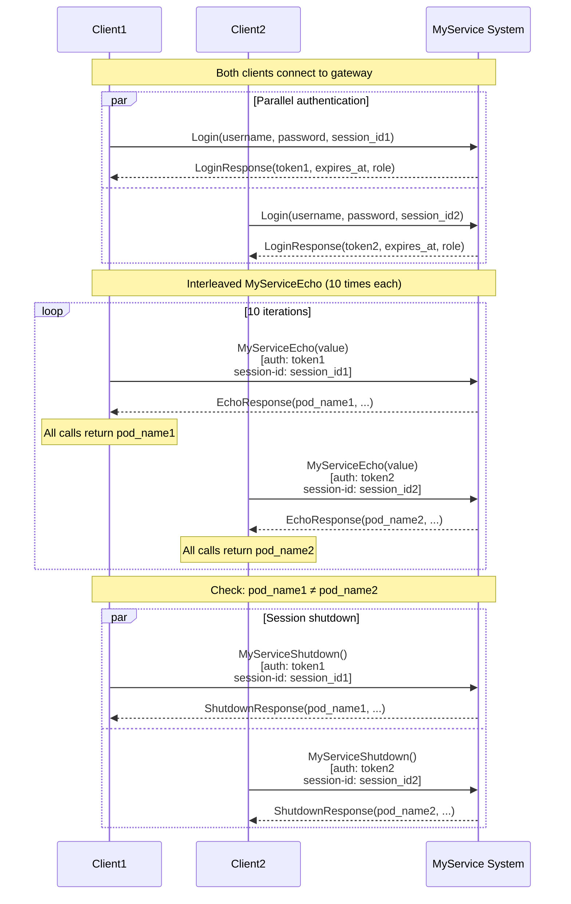

# Scenario: Sticky session with two clients

## Description

This scenario demonstrates sticky session when multiple clients are active. Two clients connect with different session_ids and the scenario verifies they are routed to different MyService instances, ensuring session isolation.

**Implementation:** [`scenario/sticky_session.go`](../scenario/sticky_session.go)  
**Run:** `./integrationtests sticky_session`

## Steps

### 1. Connect two clients

Two clients create independent gRPC connections to the API Gateway at `localhost:10000`.

### 2. Authenticate both clients

**Client 1:**
- Method: `Login`
- Parameters:
  - `username`: user name
  - `password`: password
  - `session_id`: unique session_id for client 1 (e.g. "integration-test-session-client1-{timestamp}")

**Client 2:**
- Method: `Login`
- Parameters:
  - `username`: user name (can be the same)
  - `password`: password
  - `session_id`: unique session_id for client 2 (e.g. "integration-test-session-client2-{timestamp}")

**Success response for each client:**
- `token`: JWT (different tokens for different clients)
- `expires_at`: token expiry
- `role`: user role

### 3. Interleaved MyServiceEcho calls

Both clients call `MyServiceEcho` in an interleaved manner (10 times each, 20 calls total).

**Client 1 — Request:**
- Method: `MyServiceEcho`
- Parameters:
  - `value`: string for echo
- Metadata:
  - `authorization`: "<token1>"
  - `session-id`: "<session_id1>"

**Client 2 — Request:**
- Method: `MyServiceEcho`
- Parameters:
  - `value`: string for echo
- Metadata:
  - `authorization`: "<token2>"
  - `session-id`: "<session_id2>"

**Success response (EchoResponse) for each client:**
- `client_value`: value from request
- `server_value`: "my_service"
- `pod_name`: instance identifier
- `server_session_id`: server session identifier
- `client_session_id`: client session identifier
- `index`: 0
- `server_method`: "MyServiceEcho"

**Sticky session check:**
- All calls from client 1 return the same `pod_name` (e.g. "myservice-1")
- All calls from client 2 return the same `pod_name` (e.g. "myservice-2")
- Client 1's `pod_name` **does not equal** client 2's `pod_name`
- This confirms different session_ids are routed to different instances via HASH_SET balancing

**Possible errors:**
- `UNAUTHENTICATED` (16): missing or invalid authorization token
- `INTERNAL` (13): "Session conflict: was={old_session}, now={new_session}" — if client tried to use an occupied instance
- `UNAVAILABLE` (14): "backend service unavailable" — connection error

### 4. Shut down both sessions

**Client 1:**
- Method: `MyServiceShutdown`
- Metadata:
  - `authorization`: "<token1>"
  - `session-id`: "<session_id1>"

**Client 2:**
- Method: `MyServiceShutdown`
- Metadata:
  - `authorization`: "<token2>"
  - `session-id`: "<session_id2>"

**Success response (ShutdownResponse) for each client:**
- `pod_name`: must match the one from MyServiceEcho for that client
- `server_session_id`: server session identifier
- `client_session_id`: client session identifier
- `index`: message number
- `server_method`: "MyServiceShutdown"

## Interaction diagram

## Sticky session mechanism

### How it works

1. **HASH_SET balancing:** MyGateway uses HASH_SET to distribute requests across MyService instances
2. **Hash by session-id:** Hash is computed from the `session-id` header value in request metadata
3. **Deterministic routing:** The same `session-id` is always routed to the same instance
4. **Session isolation:** Different `session-id` values may land on different instances, ensuring isolation

### Important points

- **One instance = one session:** Each MyService instance serves only one active session
- **Conflict check:** If the instance is already occupied by another session, MyService returns "Session conflict"
- **Stability:** With correct sticky session usage, all client requests go to one instance for the whole session

## Error code table

| Situation | gRPC Code | Numeric | Message |
|-----------|-----------|---------|---------|
| Session conflict | `INTERNAL` | 13 | "Session conflict: was={old_session}, now={new_session}" |
| Missing token | `UNAUTHENTICATED` | 16 | - |
| Invalid token | `UNAUTHENTICATED` | 16 | - |
| Connection error | `UNAVAILABLE` | 14 | "backend service unavailable" |
| Server session not set | `PERMISSION_DENIED` | 7 | "Server session is not set" |
| Client session mismatch | `PERMISSION_DENIED` | 7 | "Client session mismatch: client={...}, server={...}" |

## Validations

The scenario checks:

1. **Session isolation:**
   - Client 1 gets the same `pod_name` in all MyServiceEcho calls
   - Client 2 gets the same `pod_name` in all MyServiceEcho calls
   - Client 1's `pod_name` **is not equal** to client 2's `pod_name`

2. **Response correctness:**
   - All EchoResponse fields are correct
   - `server_value == "my_service"`
   - `index == 0` for all MyServiceEcho calls

3. **Clean shutdown:**
   - MyServiceShutdown returns the same `pod_name` as in MyServiceEcho for each client
