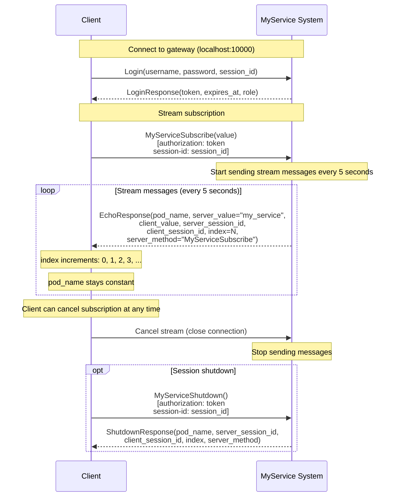

# Scenario: Stream subscription (MyServiceSubscribe)

## Description

This scenario demonstrates the server-stream method `MyServiceSubscribe`, which sends the client a stream of messages at a fixed interval. The client connects, subscribes to the stream, and receives continuous updates from a MyService instance.

**Status:** Described scenario (may not be implemented in test code)

## Steps

### 1. Connect to the system

The client creates a gRPC connection to the API Gateway at `localhost:10000`.

### 2. Authentication (Login)

**Request:**
- Method: `Login`
- Parameters:
  - `username`: user name
  - `password`: password
  - `session_id`: unique client session identifier

**Success response:**
- `token`: JWT for subsequent requests
- `expires_at`: token expiry
- `role`: user role

### 3. Stream subscription (MyServiceSubscribe)

**Request:**
- Method: `MyServiceSubscribe` (server stream)
- Parameters:
  - `value`: string for stream (used as session_id)
- Metadata headers:
  - `authorization`: "<token>" (JWT from Login)
  - `session-id`: "<session_id>" (same session_id as in Login)

**Stream responses (EchoResponse):**

The system sends `EchoResponse` messages every 5 seconds:

**First message (index = 0):**
- `client_value`: value from request
- `server_value`: "my_service"
- `pod_name`: unique instance identifier
- `server_session_id`: server session identifier
- `client_session_id`: client session identifier from header
- `index`: 0
- `server_method`: "MyServiceSubscribe"

**Later messages (index = 1, 2, 3, ...):**
- Same fields as the first message
- `index`: increments with each message (1, 2, 3, ...)
- `pod_name`: unchanged (sticky session)
- `server_session_id`: unchanged
- `client_session_id`: unchanged

**Send interval:** 5 seconds between messages

**Sticky session check:**
- All messages in the stream must have the same `pod_name`
- This confirms the stream is served by the same instance

### 4. Cancel subscription

The client can cancel at any time by closing the stream.

**On cancel:**
- The system stops sending messages
- The connection closes
- Session on the instance may remain active (implementation-dependent)

### 5. Session shutdown (optional)

After the stream ends the client may call `MyServiceShutdown` to shut down the session.

**Request:**
- Method: `MyServiceShutdown`
- Metadata:
  - `authorization`: "<token>"
  - `session-id`: "<session_id>"

**Success response:**
- `pod_name`: must match the one from MyServiceSubscribe
- `server_session_id`: server session identifier
- `client_session_id`: client session identifier
- `index`: message number
- `server_method`: "MyServiceShutdown"

## Interaction diagram



## Stream behavior

### Situations

**1. Normal operation:**
- Messages sent every 5 seconds
- `index` increments with each message
- All messages have the same `pod_name` (sticky session)

**2. Client cancel:**
- Client closes the stream
- System stops sending
- Connection closes cleanly

**3. Instance failure during stream:**
- If the instance fails during an active stream:
  - MyGateway may retry and route to another instance
  - The new instance may return a session conflict (session was bound to the old instance)
  - Client gets an error and may reconnect

**4. Session conflict:**
- If the instance is already occupied by another session:
  - Returns `INTERNAL` (13): "Session conflict: was={old_session}, now={new_session}"
  - Stream is not established

## Error code table

| Situation | gRPC Code | Numeric | Message |
|-----------|-----------|---------|---------|
| Session conflict | `INTERNAL` | 13 | "Session conflict: was={old_session}, now={new_session}" |
| Missing token | `UNAUTHENTICATED` | 16 | - |
| Invalid token | `UNAUTHENTICATED` | 16 | - |
| No available instances | `RESOURCE_EXHAUSTED` | 8 | "no available instances" |
| All instances busy | `RESOURCE_EXHAUSTED` | 8 | "all instances are busy" |
| Connection error | `UNAVAILABLE` | 14 | "backend service unavailable" |
| Stream interrupted | `UNAVAILABLE` | 14 | - (on instance failure) |

## Validations

The scenario should verify:

1. **Stream setup:**
   - Stream is established
   - First message is received

2. **Message sequence:**
   - Messages arrive at ~5 second intervals
   - `index` increments (0, 1, 2, 3, ...)
   - `server_method == "MyServiceSubscribe"` for all messages

3. **Sticky session:**
   - All messages have the same `pod_name`
   - `server_session_id` and `client_session_id` stay constant

4. **Data correctness:**
   - `client_value` matches the sent value
   - `server_value == "my_service"`
   - All required fields are set

5. **Stream cancel:**
   - Client can cancel the subscription
   - System stops sending

## Usage example

```go
// Pseudocode for MyServiceSubscribe usage

// 1. Authenticate
token := login(username, password, sessionID)

// 2. Create context with auth
ctx := createAuthContext(token, sessionID)

// 3. Subscribe to stream
stream, err := client.MyServiceSubscribe(ctx, &EchoRequest{Value: "test-value"})
if err != nil {
    return err
}

// 4. Read from stream
for {
    response, err := stream.Recv()
    if err == io.EOF {
        break
    }
    if err != nil {
        return err
    }
    
    fmt.Printf("Received: index=%d, pod_name=%s\n", response.Index, response.PodName)
    
    if firstPodName == "" {
        firstPodName = response.PodName
    } else if response.PodName != firstPodName {
        return fmt.Errorf("sticky session violation")
    }
}

// 5. Cancel (optional)
stream.CloseSend()
```

## Notes

- **Message interval:** Messages are sent every 5 seconds (configurable in MyService)
- **Infinite stream:** Stream continues until the client cancels or an error occurs
- **Sticky session:** The stream is served by one instance for the whole subscription
- **Implementation:** This scenario may not be implemented in current integration tests
