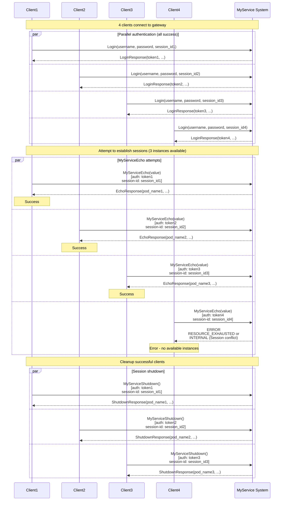

# Scenario: System overload (more clients than instances)

## Description

This scenario demonstrates system behavior when there are more clients than available MyService instances. When 4 clients try to connect to a system with 3 instances, some clients get instances successfully and the rest get errors indicating no available resources.

**Implementation:** [`scenario/system_overload.go`](../scenario/system_overload.go)  
**Run:** `./integrationtests system_overload`

**Related requirements:**
- FR-MG-5: Handling no instances
- FR-MS-3: Session management (one instance = one session)
- FR-4: Sticky session and client binding to instances

## Steps

### 1. Connect four clients

Four clients create independent gRPC connections to the API Gateway at `localhost:10000`.

### 2. Authenticate all clients

All four clients authenticate successfully:

**Clients 1–4:**
- Method: `Login`
- Parameters:
  - `username`: user name
  - `password`: password
  - `session_id`: unique per client (e.g. "integration-test-session-client1-{timestamp}", "integration-test-session-client2-{timestamp}", etc.)

**Success response for each:**
- `token`: JWT (different per client)
- `expires_at`: token expiry
- `role`: user role

**Note:** Authentication always succeeds; it does not depend on MyService instance availability.

### 3. Attempt to establish sessions (MyServiceEcho)

All four clients try to establish sessions via `MyServiceEcho`:

**Request per client:**
- Method: `MyServiceEcho`
- Parameters:
  - `value`: string for echo
- Metadata:
  - `authorization`: "<token>" (unique per client)
  - `session-id`: "<session_id>" (unique per client)

**Expected results:**

**Successful clients (typically 3 of 4):**
- Receive `EchoResponse` with:
  - `pod_name`: instance identifier (different per client)
  - `server_value`: "my_service"
  - `client_value`: value from request
  - `server_session_id`: server session identifier
  - `client_session_id`: client session identifier
  - `index`: 0
  - `server_method`: "MyServiceEcho"

**Unsuccessful clients (typically 1+ of 4):**  
Receive one of:

1. **RESOURCE_EXHAUSTED (8):**
   - Message: "no available instances" or "all instances are busy"
   - Returned by MyGateway when all instances are occupied

2. **UNAVAILABLE (14):**
   - Message: "service unavailable" or "backend service unavailable"
   - Returned by MyGateway when no instances are available

3. **INTERNAL (13):**
   - Message: "Session conflict: was={old_session}, now={new_session}"
   - Returned by MyService when MyGateway via HASH_SET routed the request to an already occupied instance
   - This can happen because HASH_SET may map several different session_ids to the same instance

### 4. Cleanup successful clients

Successful clients shut down their sessions via `MyServiceShutdown`:

**Request:**
- Method: `MyServiceShutdown`
- Metadata:
  - `authorization`: "<token>"
  - `session-id`: "<session_id>"

**Success response:**
- `pod_name`: must match the one from MyServiceEcho
- `server_session_id`: server session identifier
- `client_session_id`: client session identifier
- `index`: message number
- `server_method`: "MyServiceShutdown"

## Interaction diagram

## Overload handling mechanism

### How it works

1. **Resource limit:** Each MyService instance serves only one active session at a time
2. **HASH_SET distribution:** MyGateway uses HASH_SET to distribute requests by session-id
3. **Overload conflict:** When there are more clients than instances:
   - Some clients get instances
   - The rest get errors when trying to connect
4. **Error types:**
   - **RESOURCE_EXHAUSTED/UNAVAILABLE:** MyGateway detects no available instances
   - **INTERNAL (Session conflict):** MyGateway routed the request to an occupied instance via HASH_SET

### Important points

- **Determinism:** HASH_SET ensures the same session-id always goes to the same instance
- **Uneven distribution:** Different session-ids can land on the same instance due to hash collisions
- **Graceful degradation:** The system returns clear errors under overload

## Error code table

| Situation | gRPC Code | Numeric | Message | Source |
|-----------|-----------|---------|---------|--------|
| No available instances | `RESOURCE_EXHAUSTED` | 8 | "no available instances" | MyGateway |
| All instances busy | `RESOURCE_EXHAUSTED` | 8 | "all instances are busy" | MyGateway |
| Service unavailable | `UNAVAILABLE` | 14 | "service unavailable" or "backend service unavailable" | MyGateway |
| Session conflict | `INTERNAL` | 13 | "Session conflict: was={old_session}, now={new_session}" | MyService |
| Missing token | `UNAUTHENTICATED` | 16 | - | MyService |

## Validations

The scenario checks:

1. **Authentication:**
   - All 4 clients authenticate successfully

2. **Instance distribution:**
   - At least 1 client gets an error (more clients than instances)
   - Not all clients get an error (some must connect successfully)
   - Successful clients get different `pod_name` when there are several

3. **Error types:**
   - Errors have expected codes: `RESOURCE_EXHAUSTED`, `UNAVAILABLE`, or `INTERNAL` with "Session conflict"

4. **Cleanup:**
   - Successful clients shut down their sessions via MyServiceShutdown

## Notes

- **Instance count:** The system is typically deployed with 3 MyService instances (see `docker-compose.yml`)
- **Probabilistic behavior:** HASH_SET distribution can vary, but with 4 clients and 3 instances at least one client will get an error
- **Expected behavior:** This is normal under overload and shows resource limits
