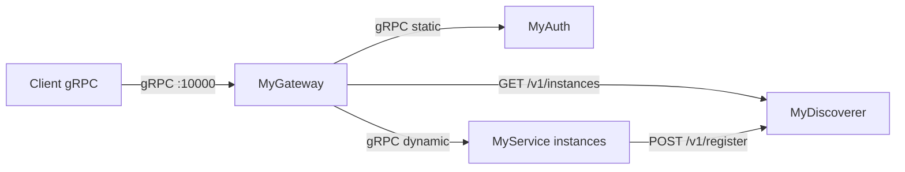

# MyGateway Solution

**API-independent gRPC proxy and load balancer** — an extensible template for systems deployed in Docker or Kubernetes.

MyGateway is **not** a plug-and-play solution. It is intended to be modified and integrated into your own systems: add custom auth, custom discoverers, custom backends, or other balancer types as needed.

---

## Architecture Overview

Clients talk to a single entry point (MyGateway). The gateway routes requests by gRPC method name to static or dynamic backend clusters (e.g. auth service, scalable worker instances discovered via HTTP).



The projects **MyAuth**, **MyDiscoverer**, **MyService**, and **IntegrationTests** in this repository are for **testing and usage examples** only. They demonstrate how to run and extend MyGateway; the main product is MyGateway itself.

Full system requirements are described in [requirements.md](requirements.md).

---

## MyGateway

### What is MyGateway

MyGateway is an **API-independent** gRPC proxy and load balancer. It is not tied to any specific `.proto` or service contract: it routes and proxies **any** gRPC traffic by full method name and metadata.

- **Transparent payload forwarding**: Request and response bodies are forwarded without parsing protobuf in application code (using `emptypb.Empty`).
- **Transport-level operation**: Routing, headers, and backend selection only.
- **Single entry point**: Clients connect to one address; multiple backend clusters (auth, workers, etc.) sit behind the gateway.

### Functionality

| Area | Description |
|------|-------------|
| **Proxy** | Handles all gRPC calls (unary and streaming) via `grpc.UnknownServiceHandler`. Full method name from stream context; payload passed through without app-level deserialization. |
| **Routing** | Longest-prefix match on full method name (e.g. `/my_service.MyServiceAPI/Login`, `/my_service.MyServiceAPI/MyService`). Routes map a prefix to a cluster, authorization policy, and balancer. |
| **Authorization** | Per-route: `none` (pass through) or `required` (metadata `session-id` + `authorization` JWT; HMAC-SHA256, expiry, `session_id` in claims). |
| **Balancing** | `round_robin` or `sticky_sessions` (binding by a configurable header, e.g. `session-id`). |
| **Clusters** | **Static**: single gRPC address, one persistent connection. **Dynamic**: instance list from an HTTP Discoverer; connection pool, periodic refresh, round-robin or sticky by key. |
| **Failure handling** | On backend stream/connect failure: `OnBackendFailure` (unbind sticky key, close conn, unregister instance). Retry up to `RETRY_COUNT` with `RETRY_TIMEOUT_MS` per attempt on another instance. Session transfer for unary/server-stream (replay first client message on new backend). |

### Usage Scenarios (Happy Paths)

1. **Method without auth (e.g. Login)**  
   Client calls a method whose route has `authorization: none`. Gateway matches route, passes headers through, resolves backend (static or round-robin), opens stream, forwards traffic. Client gets response/stream from backend.

2. **Method with auth and sticky sessions**  
   Client sends `session-id` and `authorization` (JWT). Route has `authorization: required` and `balancer: sticky_sessions` with header `session-id`. Gateway validates JWT, resolves connection by sticky key, proxies transparently. Same `session-id` always hits the same backend instance until failure.

3. **Default route `use_cluster`**  
   If no route prefix matches, gateway can send traffic to a default cluster (configurable).

4. **Dynamic cluster refresh**  
   A background ticker calls the Discoverer (e.g. GET /v1/instances). Pool updates instance list; connections to removed instances are closed and sticky bindings cleared. New requests use only current instances.

### Error Handling and gRPC Codes

| Situation | gRPC Code | Message |
|-----------|-----------|---------|
| Empty instance list or all instances busy | `RESOURCE_EXHAUSTED` (8) | "all instances are busy" |
| Backend connection/stream failure | `UNAVAILABLE` (14) | "backend service unavailable" |
| Missing `session-id` (for routes with auth) | `UNAUTHENTICATED` (16) | "missing session-id" |
| Missing or invalid JWT (with session-id) | `UNAUTHENTICATED` (16) | "missing or invalid token" |

### Configuration

**Environment variables**

| Variable | Required | Description |
|----------|----------|-------------|
| `SERVICE_PORT_GRPC` | Yes | Listening port (1–65535), e.g. 10000. |
| `CONFIG_PATH` | Yes | Path to YAML config (absolute or relative). |
| `JWT_SECRET` | If any route has `authorization: required` | Secret for JWT verification; must match auth backend. |
| `RETRY_COUNT` | Yes | Max retries for NewStream on dynamic clusters (e.g. 3). |
| `RETRY_TIMEOUT_MS` | Yes | Timeout in ms per attempt (e.g. 5000). |

**YAML structure**

- **default**: `action: error` (return Unimplemented when no route matches) or `action: use_cluster` with `use_cluster: <cluster_id>`.
- **routes**: List of `prefix`, `cluster`, `authorization` (`none` \| `required`), `balancer` (`type: round_robin` \| `sticky_sessions`; for sticky, `header` e.g. `session-id`).
- **clusters**: For each cluster: `type: static` with `address`, or `type: dynamic` with `discoverer_url` and `discoverer_interval_ms`.

Example (see [config/gateway.docker.yaml](config/gateway.docker.yaml)):

```yaml
default:
  action: error

routes:
  - prefix: /my_service.MyServiceAPI/Login
    cluster: myauth
    authorization: none
    balancer:
      type: round_robin

  - prefix: /my_service.MyServiceAPI/MyService
    cluster: my_service
    authorization: required
    balancer:
      type: sticky_sessions
      header: session-id

clusters:
  myauth:
    type: static
    address: myauth:5001

  my_service:
    type: dynamic
    discoverer_url: http://mydiscoverer:8080
    discoverer_interval_ms: 5000
```

### External Integrations

- **Discoverer (HTTP)**  
  Contract: [MyDiscoverer OpenAPI](MyDiscoverer/api/my-discoverer.openapi.yaml).  
  - `GET {baseURL}/v1/instances` → `{"instances": [{"instance_id", "ipv4", "port"}, ...]}`.  
  - `POST {baseURL}/v1/unregister/{instance_id}` → 200 or error.  
  Gateway builds backend address as `ipv4:port`.

- **Auth backend**  
  gRPC service (e.g. Login) at a static cluster address.

- **Backend services**  
  gRPC; either a static address or instances returned by the Discoverer (dynamic cluster).

### Limitations

- Full replay of multi-message client-stream or bidi on backend failure is not implemented (only unary/server-stream with first-message replay).
- Backend connections use insecure credentials (no TLS in this template).
- Built-in auth is JWT + session-id only; other schemes require custom `HeaderProcessor` implementations.

---

## Supporting Projects

| Project | Role |
|---------|------|
| **MyAuth** | gRPC auth service (Login, JWT issuance), Redis user store. Example auth backend for the gateway. |
| **MyDiscoverer** | HTTP instance registry: POST /v1/register, GET /v1/instances, POST /v1/unregister. Example discoverer for dynamic clusters. |
| **MyService** | .NET 8 gRPC service (MyServiceEcho, MyServiceSubscribe, MyServiceShutdown). Example backend that registers with MyDiscoverer. |
| **IntegrationTests** | Go scenarios that call the gateway and validate behaviour (basic workflow, sticky session, errors, etc.). |

---

## Instructions

### Prerequisites

- **Go 1.25+** for MyGateway, MyAuth, MyDiscoverer, IntegrationTests.
- **.NET 8 SDK** for MyService.
- **Docker and Docker Compose** for running the full stack.
- **Codegen tools**: `protoc`, `protoc-gen-go`, `protoc-gen-go-grpc`, `oapi-codegen`, `moq`. From repo root: `make install` (and ensure `GOPATH/bin` or `GOBIN` is on `PATH`).

### Required Integrations to Run MyGateway

- **Auth backend** (e.g. MyAuth): gRPC service for Login (or equivalent). `JWT_SECRET` must match between gateway and auth.
- **Discoverer** (e.g. MyDiscoverer): HTTP API at `discoverer_url` with:
  - `GET /v1/instances` returning `{"instances": [{"instance_id", "ipv4", "port"}, ...]}`.
  - `POST /v1/unregister/{instance_id}`.
- For **dynamic** clusters: backend services must register with the discoverer (e.g. MyService registers and heartbeats).

### Running MyGateway

- **Build** (from `MyGateway/`): `go build -o mygateway ./cmd`
- **Run**: Set env (`SERVICE_PORT_GRPC`, `CONFIG_PATH`, `JWT_SECRET`, `RETRY_COUNT`, `RETRY_TIMEOUT_MS`), then `./mygateway`
- **Full stack**: From repo root, `make up` or `docker-compose up` (Gateway listens on 10000, config from `config/gateway.docker.yaml`).

### Running Tests

- **Unit tests**  
  - All: `make test`  
  - MyGateway only: `make test_mygateway`  
  - Others: `make test_auth`, `make test_discoverer`, `make test_integrationtests`

- **Integration tests**  
  - Build: `make build_integrationtests`  
  - All scenarios: `make itest`  
  - Single scenario: `make itest_basic_workflow`, `make itest_sticky_session`, `make itest_system_overload`, `make itest_stream_subscription`, `make itest_login_errors`, `make itest_myservice_auth_errors`, `make itest_session_transfer`, `make itest_gateway_error_unauthenticated`, `make itest_gateway_error_unavailable`, `make itest_myservice_shutdown_errors`, `make itest_no_instances_available`  
  - Some scenarios expect the stack to be up (`make up`). See [Makefile](Makefile) and [IntegrationTests/README.md](IntegrationTests/README.md).

### Extending Functionality — Files to Modify

| Extension | What to do |
|-----------|------------|
| **Custom auth** | Implement [interfaces.HeaderProcessor](MyGateway/interfaces/header_processor.go). Add to [helpers.HeaderProcessorChain](MyGateway/helpers/header_chain.go) in [cmd/main.go](MyGateway/cmd/main.go). Replace or wrap `helpers.ConfigurableAuthProcessor`. |
| **Custom discoverer** | Implement [interfaces.Discoverer](MyGateway/interfaces/discoverer.go) (`GetInstances`, `UnregisterInstance`). In [cmd/main.go](MyGateway/cmd/main.go), use your implementation instead of `adapters.DiscovererHTTP` when building dynamic pools. |
| **Custom services** | Add new routes and clusters in the YAML config; no code change needed for additional gRPC services. |
| **Other balancer types** | Extend `domain.BalancerType` in [domain/route.go](MyGateway/domain/route.go). Add handling in [service/connection_resolver_generic.go](MyGateway/service/connection_resolver_generic.go). Implement selection logic in a custom [interfaces.ConnectionPool](MyGateway/interfaces/connection_pool.go) or new pool type. |
| **New cluster types** | Extend `domain.ClusterType` in [domain/cluster.go](MyGateway/domain/cluster.go). Wire in [cmd/main.go](MyGateway/cmd/main.go) and [cmd/config.go](MyGateway/cmd/config.go) (load and build connections/pools). |
| **Custom JWT validation** | Implement [interfaces.JwtService](MyGateway/interfaces/jwt_service.go). In [cmd/main.go](MyGateway/cmd/main.go), pass your implementation instead of `service.NewJWTValidator`. |

Key interfaces: [interfaces/discoverer.go](MyGateway/interfaces/discoverer.go), [interfaces/header_processor.go](MyGateway/interfaces/header_processor.go), [interfaces/connection_pool.go](MyGateway/interfaces/connection_pool.go), [interfaces/jwt_service.go](MyGateway/interfaces/jwt_service.go).

---

## Project Structure

```
MyGateway/          # Main project: gRPC proxy and load balancer
MyAuth/             # Example gRPC auth service
MyDiscoverer/       # Example HTTP instance registry
MyService/          # Example .NET gRPC backend
IntegrationTests/   # Go integration test scenarios
config/             # Gateway YAML (e.g. gateway.docker.yaml)
docker-compose.yml  # Full stack (Redis, MyDiscoverer, MyAuth, MyService, MyGateway)
Makefile            # install, generate, test, itest_*, up, down
requirements.md     # Full system requirements
```

---

## Links

- [MyGateway/README.md](MyGateway/README.md) — detailed technical documentation
- [requirements.md](requirements.md) — full system requirements
- [IntegrationTests/README.md](IntegrationTests/README.md) — integration test scenarios
